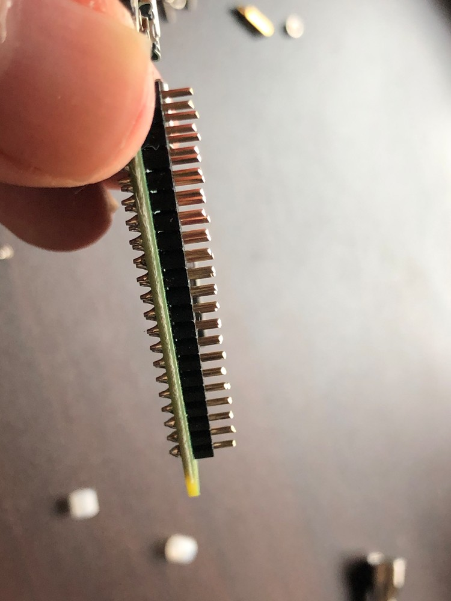

# DIY cdrom emulator build, Raspberry Pi

## Description

My notes on building a hardware cdrom emulator for ISO images using a **Raspberry Pi Zero W** and a python script **https://github.com/tjmnmk/gadget_cdrom**

**Use cases**:

- Setting up a fresh install of an OS on a computer without the need to create a bootable USB
- Running a live OS without the need to create a bootable USB
- Restoring an OS with Live CD tools
- Recovering a corrupted bootloader with boot-repair-disk-64bit.iso

What's the **difference** between my build and the pre-compiled image at https://github.com/tjmnmk/gadget_cdrom/releases ?

- **exfat** instead of fat32 for the storage
- Fully manual build on the official release of the OS **to avoid any potential security risks**
- Most **recent** release of Raspberry Pi OS Lite
- LCD display instead of OLED. It's not better or cheaper, it's just because I had bought the wrong part, and had to change the code to make it work. What do I do with all the real estate on the display? Add CPU load, temperature and free space **indicators**.
- **支持中文显示** (in file names also, but only when copying directly to the image mounted on the host computer)

## Build pictures

|  |  |  |
| :--------------------------------: | :--------------------------------: | :------------------------------------: |
|  |  |      |
| :--------------------------------: | :--------------------------------: | :------------------------------------: |
|  |  |      |
| :--------------------------------: | :--------------------------------: | :------------------------------------: |
|  |  |      |
| :--------------------------------: | :--------------------------------: | :------------------------------------: |
|  |  |      |
| :--------------------------------: | :--------------------------------: | :------------------------------------: |
|  |  |      |
| :--------------------------------: | :--------------------------------: | :------------------------------------: |
|  |  |      |
| :--------------------------------: | :--------------------------------: | :------------------------------------: |

## Parts list

- Raspberry Pi Zero WH - https://www.waveshare.com/wiki/Raspberry_Pi_Zero_W 118 元
- 64Gb A1 U1 C10 microsd card 29 元
- USB A board with pogo pins 11 元
- Plexiglass case 8 元
- 1.3inch LCD HAT - https://www.waveshare.com/wiki/1.3inch_LCD_HAT 69 元

## Software

- Raspberry Pi OS Lite - https://www.raspberrypi.org/software/operating-systems/
- https://github.com/tjmnmk/gadget_cdrom

## Build

- Cut the GPIO header pins to the right length
- Sift through the nuts and spacers left from the previous builds to find the right combination, add a heatsink if it fits
- Assemble
- Download https://downloads.raspberrypi.com/raspios_lite_armhf/images/raspios_lite_armhf-2024-07-04/2024-07-04-raspios-bookworm-armhf-lite.img.xz
- Burn the image to the microsd card using Imager
  - `sudo apt install rpi-imager`
  - `rpi-imager`
- Mount the microsd card on the host computer

- Enable SSH

  - `sudo touch /media/$USER/bootfs/ssh`

- Add user

  - `echo "rpiuser:$(echo 'rpipassword' | openssl passwd -6 -stdin)" | sudo tee /media/$USER/bootfs/userconf`

- Enable modules

      - `echo "dtoverlay=dwc2" | sudo tee -a /media/$USER/bootfs/config.txt`
      - `echo "dwc2" | sudo tee -a /media/$USER/rootfs/etc/modules`

- Unmount, put the card into the rpi, connect a USB-Ethernet adapter to the Raspberry Pi, hook up the USB-Ethernet adapter to a power source, connect the adapter with Ethernet cable to a router for Internet access
- Boot the Raspberry Pi
- SSH into the Raspberry Pi

  - `ssh -o IdentitiesOnly=yes rpiuser@raspberrypi.lan` password `rpipassword`.

- At this point the commands are run on the Raspberry Pi

- Enable wifi for debugging

  - `sudo nano /etc/network/interfaces`

    - ```
      auto wlan0
      allow-hotplug wlan0
      iface wlan0 inet dhcp
      iface default inet dhcp

      ```

  - `sudo systemctl restart systemd-networkd`

    - `wpa_passphrase 'tempwifi' '9eu8xdexm08rfh0w9erf9ewf09wexr' | sudo tee /etc/wpa_supplicant/wpa_supplicant-wlan0.conf`
    - ```
      sudo tee -a /etc/wpa_supplicant/wpa_supplicant-wlan0.conf <<EOF
      country=CN
      ctrl_interface=DIR=/var/run/wpa_supplicant GROUP=netdev
      update_config=1
      ap_scan=1
      EOF
      ```

    - `sudo chmod 640 /etc/wpa_supplicant/wpa_supplicant-wlan0.conf`
    - `sudo systemctl enable wpa_supplicant@wlan0.service`
    - `sudo systemctl start wpa_supplicant@wlan0.service`

- Disable IPv6

  - `sudo nano /etc/sysctl.conf`

    - ```
      net.ipv6.conf.all.disable_ipv6 = 1
      net.ipv6.conf.default.disable_ipv6 = 1
      net.ipv6.conf.lo.disable_ipv6 = 1
      ```

  - `sudo sysctl -p`

- Reconnect with wifi

- Enable SPI and set the time zone for the SSL to work correctly

  - `sudo raspi-config`
    - Interface Options, SPI, Yes, Back
    - Localisation Options, Timezone, Asia, Shanghai, Finish, Reboot (or use `sudo dpkg-reconfigure tzdata`)

- (optional) Replace the original repository with Chinese mirrors if in China

  - ```
    deb http://archive.raspberrypi.com/debian/ bookworm main
    # Uncomment line below then 'apt-get update' to enable 'apt-get source'
    #deb-src http://archive.raspberrypi.com/debian/ bookworm main
    ```

  - ```
    sudo tee /etc/apt/sources.list.d/raspi.list <<EOF
    deb https://mirrors.tuna.tsinghua.edu.cn/raspbian/raspbian/ bookworm main non-free contrib rpi
    deb-src https://mirrors.tuna.tsinghua.edu.cn/raspbian/raspbian/ bookworm main non-free contrib rpi
    # deb [arch=arm64] https://mirrors.tuna.tsinghua.edu.cn/raspbian/multiarch/ bookworm main
    EOF
    ```

  - `sudo sed -i '1s/^/#/' /etc/apt/sources.list`

- (optional) Create a larger swap file

  - `sudo swapoff -a`
  - `sudo dd if=/dev/zero of=/swap bs=1M count=1024`
  - `sudo mkswap /swap`
  - `sudo chmod 600 /swap`
  - `sudo swapon /swap`
  - `free -m`
  - `echo "/swap none swap sw 0 0" | sudo tee -a /etc/fstab`
  - `swapon --show`

- Update the Raspberry Pi

  - `sudo apt update`
  - `sudo apt upgrade`

- Install the required packages

  - `sudo apt install -y python3-psutil lm-sensors nmon screen git p7zip-full python3-rpi.gpio python3-smbus python3-spidev python3-numpy python3-pil fonts-dejavu ntfs-3g`

- Test the display
  - `cd ~`
  - `wget https://files.waveshare.com/upload/b/bd/1.3inch_LCD_HAT_code.7z`
  - `7z x 1.3inch_LCD_HAT_code.7z`
  - `sudo chmod 777 -R 1.3inch_LCD_HAT_code`
  - `cd 1.3inch_LCD_HAT_code/1.3inch_LCD_HAT_code/python`
  - `sudo python3 main.py`
- (do not use) ~~Apply kernel patch for large ISOs, recompile natively and install the kernel. Takes up a day, cross-compiling might be a better idea.~~

  - `sudo apt install bc bison flex libssl-dev make ca-certificates`
  - `screen`
  - `cd ~`
  - `git clone --depth=1 https://github.com/raspberrypi/linux`
    - or
      - `wget https://github.com/raspberrypi/linux/archive/refs/heads/rpi-6.6.y.zip`
      - `unzip rpi-6.6.y.zip`
      - `mv linux-rpi-6.6.y linux`
  - `cd linux`
  - `KERNEL=kernel`
  - `head Makefile -n 4`

    - ```

      # SPDX-License-Identifier: GPL-2.0

      VERSION = 6
      PATCHLEVEL = 6
      SUBLEVEL = 56

      ```

  - `cp drivers/usb/gadget/function/storage_common.c drivers/usb/gadget/function/storage_common.c.updated`
  - create a patch
    - `nano drivers/usb/gadget/function/storage_common.c.updated`
    - remove six lines at line 243
    - might as well create a patch while you're at it
      - `diff -Naru drivers/usb/gadget/function/storage_common.c drivers/usb/gadget/function/storage_common.c.updated > 00-remove_iso_limit.patch`
  - or just use the included patch for version 6.6.56
    - `patch drivers/usb/gadget/function/storage_common.c 00-remove_iso_limit.patch`
  - `make bcmrpi_defconfig`
  - `make -j1 zImage modules dtbs`
  - `sudo make -j1 modules_install`
  - `sudo cp /boot/firmware/$KERNEL.img /boot/firmware/$KERNEL-backup.img`
  - `sudo cp arch/arm/boot/zImage /boot/firmware/$KERNEL.img`
  - `sudo cp arch/arm/boot/dts/broadcom/*.dtb /boot/firmware/`
  - `sudo cp arch/arm/boot/dts/overlays/*.dtb* /boot/firmware/overlays/`
  - `sudo cp arch/arm/boot/dts/overlays/README /boot/firmware/overlays/`
  - `sudo reboot`

- Shutdown the Pi, remove the microsd card, mount it on the host computer (/media/$USER/bootfs and /media/$USER/rootfs), apply the patch and cross-compile the kernel. Ubuntu 24.04 host for cross-compiling

  - `sudo apt install bc bison flex libssl-dev make libc6-dev libncurses5-dev`
  - `sudo apt install crossbuild-essential-armhf`
  - `cd ~`
  - `git clone --depth=1 https://github.com/raspberrypi/linux`
  - `cd linux`
  - `KERNEL=kernel`
  - `make ARCH=arm CROSS_COMPILE=arm-linux-gnueabihf- bcmrpi_defconfig`
  - check the version `head Makefile -n 4`
  - apply the patch `patch drivers/usb/gadget/function/storage_common.c 00-remove_iso_limit.patch`
  - `make -j8 ARCH=arm CROSS_COMPILE=arm-linux-gnueabihf- zImage modules dtbs`
  - `sudo env PATH=$PATH make -j8 ARCH=arm CROSS_COMPILE=arm-linux-gnueabihf- INSTALL_MOD_PATH=/media/$USER/rootfs modules_install`
  - `sudo cp /media/$USER/bootfs/$KERNEL.img /media/$USER/bootfs/$KERNEL-backup.img`
  - `sudo cp arch/arm/boot/zImage /media/$USER/bootfs/$KERNEL.img`
  - `sudo cp arch/arm/boot/dts/broadcom/*.dtb /media/$USER/bootfs/`
  - `sudo cp arch/arm/boot/dts/overlays/*.dtb* /media/$USER/bootfs/overlays/`
  - `sudo cp arch/arm/boot/dts/overlays/README /media/$USER/bootfs/overlays/`
  - `sudo umount /media/$USER/bootfs`
  - `sudo umount /media/$USER/rootfs`

- Install the gadget_cdrom

  - `cd /opt`
  - `sudo git clone https://github.com/tjmnmk/gadget_cdrom.git`
  - `sudo git clone https://github.com/placebeyondtheclouds/rpi-cdrom-emulator-build.git`
  - `cd gadget_cdrom`
  - copy files
    - `sudo cp /opt/rpi-cdrom-emulator-build/gadget_cdrom_lcd.py /opt/gadget_cdrom/`
    - `sudo cp /opt/rpi-cdrom-emulator-build/configST7789.py /opt/gadget_cdrom/`
    - `sudo cp /opt/rpi-cdrom-emulator-build/ST7789.py /opt/gadget_cdrom/`
    - `sudo cp /opt/rpi-cdrom-emulator-build/gadget_cdrom_lcd.service /opt/gadget_cdrom/gadget_cdrom_lcd.service`
    - `sudo wget https://archlinux.org/packages/extra/any/wqy-microhei-lite/download/ -O /opt/gadget_cdrom/font.tgz`
    - `sudo tar -xvf /opt/gadget_cdrom/font.tgz -C /`
  - `sudo chmod +x *.py`
  - `sudo ./create_image.sh`, 40GB, exfat
  - `sudo ln -s /opt/gadget_cdrom/gadget_cdrom_lcd.service /etc/systemd/system/gadget_cdrom_lcd.service`
  - `sudo systemctl enable gadget_cdrom_lcd.service`
  - `sudo systemctl restart gadget_cdrom_lcd.service`
  - `sudo reboot`

- (optional) Backup

  - `cd ~`
  - `sudo dd if=/dev/sdb | gzip -9 > cdemu-backup.img.gz`
    - restore later with `sudo zcat cdemu-backup.img.gz | sudo dd of=/dev/sdb` if needed

- (optional) Fast copy ISO files from the host computer to the memory card

  - `sudo mkdir /mnt/iso`
  - `sudo mount /dev/sdb2 /media/$USER/rootfs`
  - `cd /media/$USER/rootfs`
  - `sudo mount -t exfat "$(sudo losetup -PLf iso.img --show)p1" /mnt/iso`
  - `sudo cp ~/Downloads/boot-repair-disk-64bit.iso /mnt/iso`
  - `sudo umount /mnt/iso`
  - `sudo umount /media/$USER/rootfs`

- (optional) Mount the image from inside the rpi
  - `sudo systemctl stop gadget_cdrom_lcd.service`
  - `sudo umount /iso`
  - `sudo mount -t exfat "$(sudo losetup -PLf /iso.img --show)p1" /iso`
  - `sudo umount /iso`

## Todo

[] fix display flickering
[] fix Chinese file names

## Takeaways

- Long startup time, about a minute

## References

- Gadget CD-ROM Python script https://github.com/tjmnmk/gadget_cdrom
- Kernel compilation https://www.raspberrypi.com/documentation/computers/linux_kernel.html

## bugfixes

```
DEBUG:__main__:isolist: []
DEBUG:__main__:Pressed mount
Traceback (most recent call last):
  File "/opt/gadget_cdrom/gadget_cdrom.py", line 382, in <module>
    Main().main()
  File "/opt/gadget_cdrom/gadget_cdrom.py", line 355, in main
    f()
  File "/opt/gadget_cdrom/gadget_cdrom.py", line 370, in _button_mount
    self._state.insert_iso()
  File "/opt/gadget_cdrom/gadget_cdrom.py", line 140, in insert_iso
    iso_name = self.iso_ls()[self.get_iso_select()]
               ~~~~~~~~~~~~~^^^^^^^^^^^^^^^^^^^^^^^
IndexError: list index out of range
```
